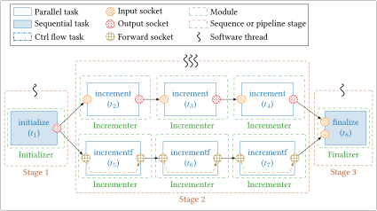
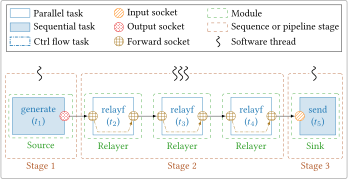
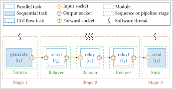

## Introduction

The forward socket is a new feature added to `AFF3CT-core` to improve the performances of some applications. As said in [Socket](Socket.md), the `SFWD` works as an input and output at the same time, it receives its `dataptr` for the input bound socket and this same pointer is sent to all the output bound sockets, which means that all the consecutive tasks bound by `SFWD` share the same memory space.

```mermaid
graph LR;
A(FWD)-->B(FWD); A(FWD)-.->K{MEM};
B(FWD)-->C(FWD); B(FWD)-.->K{MEM};
C(FWD)-->F(FWD); C(FWD)-.->K{MEM};
F(FWD)-.->K{MEM};
```

## Technical improvement
The addition of the forward socket wasn't too difficult, because it behaves the same way as the existing sockets, we just had to distinguish when it's used as an input and when it's an output. The most challenging part was adding the support of this socket for the pipelines.
### Forward sockets and pipelines
As explained in the adaptor part in [Pipeline & Adaptor](Pipeline & Adaptor.md), we use a buffer pool between every stage of the pipeline, the adaptor gets a buffer from this pool (`dataptr`) and gives it as an input for the stage first task `SIN`, the new data are written to the `SOUT` memory space so that the data are coherent for all the next tasks. The forward sockets are all pointing to the same `dataptr`, so getting a new buffer means that we have to update the `dataptr` of all the consecutive bound forward sockets to this new memory space. The same update need to be done in reverse when the `dataptr` is exchanged at the end of the stage. For that we added the two functions explained in [Sequence & Subsequence](Sequence & Subsequence.md) `explore_thread_rec` and `explore_thread_rec_reverse`.

### Tests

We have added some specific tests to check the robustness of our modifications.

=== "Pipeline with two different chains"
      
    `./pipeline_double_chain -t 3`  
    The purpose of this graph is to test the buffer exchange with `SIO` and `SFWD`, both on the same stage.  
=== "Pipeline distant stage connection"
      
    `./complex_pipeline_full_fwd -t 3`  
    The purpose of this graph is to test a `SFWD` bound to two `SFWD` in two different stages, and how the buffer exchange behave with connections between distant stages $S1$ and $S4$.  
=== "Pipeline with two different chains and distant stage connection"
      
    `./complex_pipeline_inter_stage -t 3`  
        This test is a combination of the two previous tests, we have a `SOUT` bound to a `SIN` in stage $S2$ and a `SFWD` in stage $S4$.

#### Generic pipeline

We have also added a new test to generate pipelines by choosing the middle tasks (the initial `Init` and last task `Sink` are automatically added) using these parameters :

- `-n` : the number of tasks on each stage.
- `-t` : the number of thread on each stage.
- The socket type (`SIO` or `SFWD`) of the tasks :
    - `-r` : specifying each task socket type.
    - `-R` : specifying socket type by stage (All the sockets of the stage will be of this type).  
!!! note
    `-r` and `-R` parameters are exclusive.

There are some examples of generated pipelines :
=== "Simple pipeline"
      
    `test-generic-pipeline -n "(3)" -t "(3)" -R "(SIO)"`
=== "Simple pipeline forward"
      
    `test-generic-pipeline -n "(3)" -t "(3)" -R "(SFWD)"`
=== "Simple pipeline hybrid"
      
    `test-generic-pipeline -n "(3)" -t "(3)" -r "((SFWD,SIO,SFWD))"`