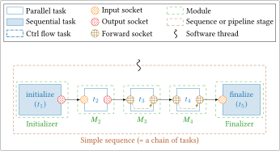

<a name="Sequence"></a>
## Sequence

Sequence is a set of task and an execution order defined by their binding.



### Attributes 
```cpp 
size_t  n_threads;
``` 
Thread number executing the sequence.

```cpp
std::vector<tools::Digraph_node<Sub_sequence>*>  sequences;
```
Vector of [Subsequences](#Subsequence) of the main sequence.

```cpp
std::vector<size_t>  firsts_tasks_id;
std::vector<size_t>  lasts_tasks_id;
std::vector<std::vector<runtime::Task*>>  firsts_tasks;
std::vector<std::vector<runtime::Task*>>  lasts_tasks;
```
Vectors used to get the firsts and lasts tasks of the sequence. The first tasks are the ones without parents, and  the last are the ones without children in the constructed [Subsequences](#Subsequence) [digraph](#Digraph). 

```cpp
std::vector<std::vector<module::Module*>>  all_modules;
```
Vector of modules contained within the sequence. 

###  Methods

```cpp
void  gen_processes(const  bool  no_copy_mode  =  false);
```
This function is the most important of the sequence class, its main purpose is to browse the subsequence graph and perform some operations modifying the original sequence bind and the function of some tasks to add more features to the original execution for more performance or coherence. Before reading the modifications applied by the function, you have to see for  [Adaptor](Pipeline & Adaptor.md) and [Switcher](Switcher.md).

 - `push_task` & `pull_task` : as we explained in the adaptor part, the tasks change their `dataptr` when they get the new buffers from the interstage pool, the new pointer needs to be updated for each socket bound to the old one. `gen_processes` performs the update every time it finds a `pull or push task`.
 - `commute_task` & `select_task` : this two tasks are used to select which path to flow for the execution, when a path is selected the bound sockets needs to update their `dataptr` to follow the right one.
 - `Other tasks` : original execution.

```cpp
void explore_thread_rec(Socket* socket, std::vector<runtime::Socket*>& list_fwd);
```
The function called by `gen_processes` to get all the bound sockets (next) of the modified one, if the encountred socket is of type forward the function is called recursively on this new socket.This call is performed once at sequence build. (See [Forward socket](Forward socket.md))

```cpp
void explore_thread_rec_reverse(Socket* socket, std::vector<runtime::Socket*>& list_fwd);
```
The function does the same thing as the previous one, but in the other sense (previous).

<a name="Subsequence">
## Subsequence
</a>

When [control flow tasks](./Switcher.md) are introduced into a sequence, the execution is not only defined by the tasks binding but also by their outputs. For this purpose tasks are grouped into subsequences.  
Subsequences are organized in a [directed graph](#Digraph) with 2 nodes designated as start and end respectively, this graph is recursively built during a sequence initialization from the first task and going from bound `output` or `forward` socket to bound `output` or `forward` socket, when a control flow task is reached a new control flow node is created and new children nodes for each of its *paths*, only a single of those paths can be taken during execution hence why they are refered to as *exclusive paths*. This also means that a sequence with no control flow task will always have a single subsequence, because it has a single path.

Upon execution the sequence will iterate over its subsequences and execute every task they contain, if one of those tasks happens to be a Commute it will select the children node designated by its *path* attribute thus branching in the execution.

### Attributes

```cpp
subseq_t type;
```
The subsequence types are `STD`, `COMMUTE` and `SELECT`, they are used by `_exec()` to determine which exclusive path to take during execution.  

```cpp
std::vector<std::function<const int*()>> processes;
```
Whenever `_exec()` reaches a new subsequence it executes every function contained in this list, there is one for each task in the subsequence. Refer to `gen_processes()` to understand how they are created and what they contain.  

```cpp
std::vector<size_t> tasks_id;
```
The ids of the tasks the `processes` were generated from, `tasks_id[0]` is the id of task `processes[0]` was made with.  

```cpp
size_t id;
```
The subsequence's id.  
```cpp
std::vector<std::vector<std::vector<Socket*>>> rebind_sockets;
std::vector<std::vector<std::vector<void*>>> rebind_dataptrs;
```
This two vectors are used within the `gen_process` function to save the sockets and their `dataptr` to update after a runtime rebinding. 

<a name="Digraph">
## Digraph
</a>

[Subsequences](#Subsequence) make up a directed graph. Whenever a subsequence is accessed it is through this class as subsequences themselves do not contain information regarding the graph.

### Attributes

```cpp
std::vector<Digraph_node<T>*> fathers;
std::vector<Digraph_node<T>*> children;
```
The nodes pointing to this node and the ones it points to respectively.  

```cpp
T* contents; /*!< Pointer to the node contents, could be anything. */
```
The contents of the node, usually a [subsequence](#Subsequence).