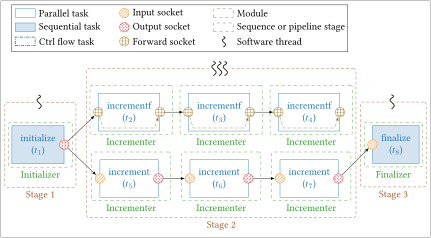
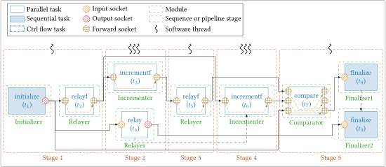

# Forward Socket 

## Introduction

The forward socket is a new feature added to `AFF3CT-core` to improve the
performance and the flexibility in some applications. As mentioned in the 
[Socket](socket.md) section, the `SFWD` works as an input and output at the same 
time. It receives its `dataptr` from the input bound socket and this same 
pointer is sent to all the output bound sockets, which means that all the 
consecutive tasks bound by `SFWD` share the same memory space.

```mermaid
graph LR;
A(FWD)-->B(FWD); A(FWD)-.->K{MEM};
B(FWD)-->C(FWD); B(FWD)-.->K{MEM};
C(FWD)-->F(FWD); C(FWD)-.->K{MEM};
F(FWD)-.->K{MEM};
```

## Technical Improvements

The implementation of the forward socket for [sequences](sequence.md) was mainly 
straightforward because it behaves the same way as the input and output sockets. 
We just had to distinguish when it is used as an input and when it is used as an 
output. However, **the most challenging part was to combine forward socket with 
the [pipeline](pipeline.md)**. Especially when forward sockets are bound from 
one stage to an other.

### Forward Sockets and Pipelines

As explained in the [Adaptor](pipeline.md#Adaptor) section, a pool of buffers 
is used between each stage of the pipeline. The adaptor gets a buffer from 
this pool and uses it to update the output socket of its `pull` task 
(`dataptr` attribute). This output socket is then bound to the input socket of 
the next tasks. In other words, all the input sockets connected to the `pull` 
output socket need to be updated with the new `dataptr` address.

The forward sockets are all pointing to the same `dataptr`, so getting a new 
buffer means that we have to update the `dataptr` of all the consecutive bound 
forward sockets to this new memory space. In the [sequence](sequence.md), the 
same update need to be done in the reversed way when the `dataptr` is exchanged 
at the end of the stage. For that, we added two recursive methods as explained 
in the [sequence](sequence.md) section (see 
[`explore_thread_rec()`](sequence.md#Explore_thread_rec) and 
[`explore_thread_rec_reverse()`](sequence.md#Explore_thread_rec_reverse) 
methods).

Moreover, when multiple forward sockets are crossing [pipeline](pipeline.md) 
stages, we need to check if these forward sockets are pointing to a same 
`dataptr` or to different `dataptr`s. In the case where multiple forward sockets 
are crossing [pipeline](pipeline.md) stages and are pointing to the same 
`dataptr`, only one buffer need to be created in the 
[adaptors](pipeline.md#Adaptor). To detect this, a map to record the previous 
`dataptr` is used (see the `fwd_source` variable in the code).

### Tests

Some specific tests have been added to the project to validate the robustness of 
the forward socket implementation.

#### Specific for Forward Socket

=== "Pipeline with two different chains"
    <figure markdown>
      { width="700" }
      <figcaption>`test-pipeline-double-chain`.</figcaption>
    </figure>
    ```bash
    test-pipeline-double-chain -t 3
    ```  
    The purpose of this graph is to test the buffer exchange with `SIO` and
    `SFWD`, both on the same stage.

=== "Pipeline with distant stage binding (only SFWD)" 
    <figure markdown>
      { width="900" }
      <figcaption>`test-complex-pipeline-full-fwd`.</figcaption>
    </figure>
    ```bash
    test-complex-pipeline-full-fwd -t 3
    ``` 
    The purpose of this graph is to test a `SFWD` bound to two `SFWD` in two
    different stages, and how the buffer exchange behaves with connections
    between distant stages $S1$ and $S4$.

=== "Pipeline with distant stage binding (SIN, SOUT & SFWD)" 
    <figure markdown>
      { width="900" }
      <figcaption>`test-complex-pipeline-mix-fwd`.</figcaption>
    </figure>
    ```bash
    test-complex-pipeline-mix-fwd -t 3
    ``` 
    The purpose of this graph is to test a `SFWD` bound to three `SFWD` in three
    different stages ($S1 \rightarrow S2$, $S1 \rightarrow S4$ and $S1 
    \rightarrow S5$), and how the buffer exchange behaves with connections
    between distant stages. Additionally, a traditional relay task ($t4$ with 
    an input and an output socket) has been added in stage $S2$. The $t7$ 
    *compare* task ensures that all the 3 `SFWD` have the same contents.
    It is expected that the final values in $t8$ are $init + 2$ and the final
    values in $t9$ are $init + 1$. In this test, *task to task* binding is used 
    to ensure that $t4$ is executed before $t6$ and $t8$ is executed before 
    $t9$ (see the oriented dashed lines).

=== "Pipeline with distant stage binding and mix of SIN, SOUT & SFWD"
    <figure markdown>
      { width="950" }
      <figcaption>`test-complex-pipeline-inter-stage`.</figcaption>
    </figure>
    ```bash
    test-complex-pipeline-inter-stage -t 3
    ```  
    This test is a combination of the previous tests, we have a `SOUT` bound to 
    a `SIN` in stage $S2$ and a `SFWD` in stage $S4$.

----

#### Generic Pipeline

A new test with a generic pipeline has also been added. It is possible to define 
the middle tasks from the command line (the initial `Init` and last task `Sink` 
are automatically added) using these parameters:

- `-n`: the number of tasks on each stage.
- `-t`: the number of threads on each stage.
- The socket type (`SIO` or `SFWD`) of the tasks:
    - `-r`: specifying each socket type (`SIO` $\rightarrow$ `relay` task and 
            `SFWD` $\rightarrow$  `relayf` task).
    - `-R`: specifying socket type by stage (all the sockets of the stage will
      be of this type).

!!! note
    You cannot use `-r` and `-R` parameters at the same time, they are 
    exclusive.

Here are some examples of generated pipelines:

=== "Simple pipeline" 
    <figure markdown>
      { width="600" }
      <figcaption>`test-generic-pipeline`: input/output sockets & 3-stage pipeline.</figcaption>
    </figure>
    ```bash
    test-generic-pipeline -n "(3)" -t "(3)" -R "(SIO)"
    ```

=== "Simple pipeline forward"
    <figure markdown>
      { width="600" }
      <figcaption>`test-generic-pipeline`: forward sockets & 3-stage pipeline.</figcaption>
    </figure>
    ```bash
    test-generic-pipeline -n "(3)" -t "(3)" -R "(SFWD)"
    ```

=== "Simple pipeline hybrid"
    <figure markdown>
      { width="600" }
      <figcaption>`test-generic-pipeline`: hybrid in/out and forward sockets & 3-stage pipeline.</figcaption>
    </figure>
    ```bash
    test-generic-pipeline -n "(3)" -t "(3)" -r "((SFWD,SIO,SFWD))"
    ```

=== "Simple pipeline hybrid with a 5-stage pipeline"
    <figure markdown>
      { width="1100" }
      <figcaption>`test-generic-pipeline`: hybrid in/out and forward sockets & 5-stage pipeline.</figcaption>
    </figure>
    ```bash
    test-generic-pipeline -n "(4,1,2)" -t "(3,1,2)" -r "((SFWD,SIO,SFWD,SIO),(SFWD),(SIO,SIO))"
    ```
